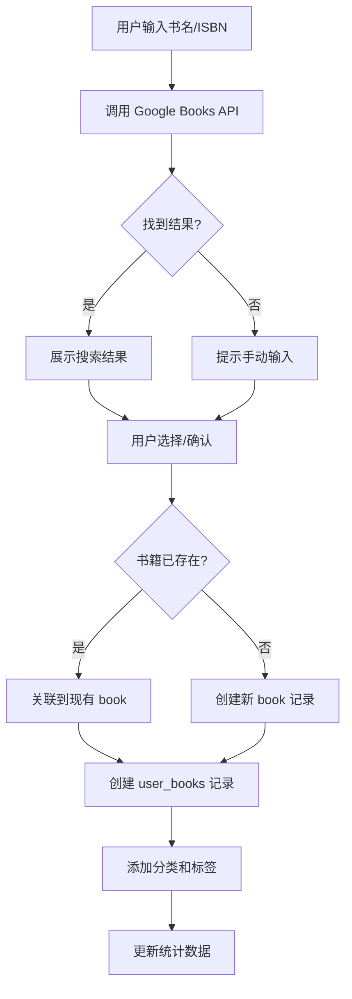

# PanelVerse - 完整设计方案

## 📋 项目概述

**PanelVerse** 是一个现代化的社区驱动型 Graphic Novel 分享平台，用户可以记录、分享和发现优秀的图像小说。

> *Explore the infinite universe of graphic novels* 🌌

### 核心价值主张
- 📚 **个人书库管理**：记录和管理自己阅读过的 graphic novels
- 🌍 **社区发现**：发现其他读者喜欢的作品
- 🏷️ **智能分类**：灵活的分类和标签系统
- 🤝 **社交互动**：评分、评论、关注功能

---

## 🎨 用户体验设计

### 页面结构

#### 1. **首页 (Home)**
```
┌─────────────────────────────────────────────────────┐
│  Logo    [探索] [我的书库] [添加书籍]      [🔍] [👤] │
├─────────────────────────────────────────────────────┤
│                                                       │
│  🔥 本周最受欢迎  |  📅 本月热门  |  🆕 最新添加      │
│  ┌───┐ ┌───┐ ┌───┐ ┌───┐ ┌───┐                    │
│  │   │ │   │ │   │ │   │ │   │  (横向滚动卡片)     │
│  └───┘ └───┘ └───┘ └───┘ └───┘                    │
│                                                       │
│  📂 按分类浏览                                        │
│  [侦探] [情感] [非虚构] [传记] [科幻] [奇幻] ...      │
│                                                       │
│  🏷️ 热门标签                                         │
│  #noir #romance #superhero #memoir ...              │
│                                                       │
│  📊 社区统计                                          │
│  总书籍: 1,234 | 活跃读者: 567 | 本周新增: 89         │
└─────────────────────────────────────────────────────┘
```

#### 2. **分类/标签浏览页**
```
┌─────────────────────────────────────────────────────┐
│  ← 返回   侦探类 Graphic Novels                      │
├─────────────────────────────────────────────────────┤
│  排序: [最新] [热门] [评分]  筛选: [全部] [标签▼]     │
│                                                       │
│  ┌──────────┐  ┌──────────┐  ┌──────────┐          │
│  │  [封面]  │  │  [封面]  │  │  [封面]  │          │
│  │          │  │          │  │          │          │
│  │ 书名     │  │ 书名     │  │ 书名     │          │
│  │ By 作者  │  │ By 作者  │  │ By 作者  │          │
│  │ ⭐ 4.5   │  │ ⭐ 4.2   │  │ ⭐ 4.8   │          │
│  │ 👥 234人 │  │ 👥 189人 │  │ 👥 456人 │          │
│  │[View][ ]│  │[View][ ]│  │[View][ ]│          │
│  └──────────┘  └──────────┘  └──────────┘          │
│                                                       │
│  (网格布局，响应式 2-6 列)                            │
└─────────────────────────────────────────────────────┘
```

#### 3. **书籍详情页**
```
┌─────────────────────────────────────────────────────┐
│  ← 返回                                              │
├─────────────────────────────────────────────────────┤
│  ┌──────────┐   书名                                │
│  │          │   By 作者名                           │
│  │  [封面]  │   ⭐ 4.5/5 (234 评分)                 │
│  │  大图    │   👥 456 人读过                       │
│  │          │                                        │
│  └──────────┘   📂 侦探, 悬疑                        │
│                  🏷️ #noir #detective #thriller      │
│  [标记已读] [想读] [收藏]                            │
│  您的评分: ⭐⭐⭐⭐⭐                                  │
│                                                       │
│  ───────────────────────────────────────             │
│  📖 简介                                             │
│  (书籍描述，从 API 获取或用户填写)                    │
│                                                       │
│  💬 社区评价 (234)                                   │
│  ┌─────────────────────────────────────┐            │
│  │ 👤 User1  ⭐⭐⭐⭐⭐  2天前            │            │
│  │ "Amazing artwork and gripping story" │            │
│  │ 👍 12  💬 回复                        │            │
│  └─────────────────────────────────────┘            │
│                                                       │
│  📚 相似推荐                                          │
│  ┌───┐ ┌───┐ ┌───┐                                 │
└─────────────────────────────────────────────────────┘
```

#### 4. **添加书籍页面**
```
┌─────────────────────────────────────────────────────┐
│  添加 Graphic Novel                                   │
├─────────────────────────────────────────────────────┤
│  🔍 搜索书籍（使用 API）                              │
│  ┌─────────────────────────────────┐                │
│  │ 输入书名或 ISBN...               │  [搜索]       │
│  └─────────────────────────────────┘                │
│                                                       │
│  搜索结果:                                            │
│  ┌─────────────────────────────────────┐            │
│  │ [封面] 书名 - 作者 [选择这本] │                    │
│  └─────────────────────────────────────┘            │
│                                                       │
│  ────── 或手动添加 ──────                            │
│                                                       │
│  书名*       [________________]                      │
│  作者*       [________________]                      │
│  ISBN        [________________]                      │
│  封面上传    [选择文件] 或 [URL]                      │
│                                                       │
│  ⚠️ 这是 Graphic Novel 吗？                          │
│  ○ 是 (默认)  ○ 否 (非 Graphic Novel)                │
│                                                       │
│  分类*       [下拉选择] 或 [+ 创建新分类]             │
│  标签        [tag1] [tag2] [+ 添加]                  │
│                                                       │
│  您的评分    ⭐⭐⭐⭐⭐                                │
│  阅读笔记    [文本框]                                 │
│                                                       │
│  [取消]  [添加到我的书库]                             │
└─────────────────────────────────────────────────────┘
```

#### 5. **个人主页**
```
┌─────────────────────────────────────────────────────┐
│  👤 用户名                              [编辑资料]    │
├─────────────────────────────────────────────────────┤
│  📊 统计                                              │
│  已读: 120  |  想读: 45  |  关注: 23  |  粉丝: 67    │
│                                                       │
│  [我的书库] [想读列表] [关注的人] [设置]              │
│                                                       │
│  ═══════════════════════════════════                 │
│  我的 Graphic Novels (120)                           │
│  排序: [最近添加▼]  筛选: [全部分类▼]                │
│                                                       │
│  (网格展示用户添加的书籍)                             │
└─────────────────────────────────────────────────────┘
```

---

## 🏗️ 技术架构

### 推荐技术栈

#### **前端**
- **框架**: Next.js 14 (App Router)
  - 支持 SSR/SSG，SEO 友好
  - API Routes 用于 serverless functions
  - 优秀的性能和开发体验
- **样式**: Vanilla CSS + CSS Modules
  - 完全控制，现代设计
  - 暗色主题支持
- **UI 增强**:
  - Framer Motion (动画)
  - React Icons (图标)
- **状态管理**: React Context + Hooks (中小规模足够)
- **表单**: React Hook Form + Zod (验证)

#### **后端 / 数据库**
- **平台**: Cloudflare Pages + Workers
  - 全球 CDN，超快速度
  - Serverless，按需扩展
  - 免费额度慷慨
- **数据库**: Cloudflare D1 (SQLite)
  - 无服务器 SQL 数据库
  - 与 Workers 完美集成
  - 免费额度: 5GB 存储
- **文件存储**: Cloudflare R2
  - S3 兼容的对象存储
  - 存储书籍封面图片
  - 无出站费用
- **认证**: Auth.js (NextAuth.js)
  - 支持 Google OAuth
  - 支持 Twitter/X OAuth
  - 安全且易于集成

#### **外部 API 集成**
- **Google Books API**
  - 免费，每天 1000 次请求
  - 丰富的书籍元数据
  - 封面图片
- **Open Library API** (备用)
  - 免费，无限制
  - 覆盖范围广

#### **搜索功能**
- 初期: SQL 全文搜索 (D1 内置)
- 后期: Cloudflare Workers AI (如需高级搜索)

---

## 🗄️ 数据库设计

### 表结构

#### **users** - 用户表
```sql
CREATE TABLE users (
  id TEXT PRIMARY KEY,
  email TEXT UNIQUE NOT NULL,
  name TEXT,
  username TEXT UNIQUE,
  avatar_url TEXT,
  provider TEXT NOT NULL, -- 'google' | 'twitter'
  provider_id TEXT NOT NULL,
  bio TEXT,
  created_at DATETIME DEFAULT CURRENT_TIMESTAMP,
  updated_at DATETIME DEFAULT CURRENT_TIMESTAMP
);
```

#### **books** - 书籍主表（去重）
```sql
CREATE TABLE books (
  id TEXT PRIMARY KEY,
  title TEXT NOT NULL,
  author TEXT NOT NULL,
  isbn TEXT,
  cover_url TEXT,
  description TEXT,
  publisher TEXT,
  publish_date TEXT,
  page_count INTEGER,
  language TEXT DEFAULT 'en',
  is_graphic_novel BOOLEAN DEFAULT 1, -- 1=是, 0=非GN
  external_id TEXT, -- Google Books ID
  external_source TEXT, -- 'google_books' | 'open_library'
  created_at DATETIME DEFAULT CURRENT_TIMESTAMP,
  updated_at DATETIME DEFAULT CURRENT_TIMESTAMP,
  UNIQUE(external_source, external_id)
);
```

#### **user_books** - 用户书籍关系（阅读记录）
```sql
CREATE TABLE user_books (
  id TEXT PRIMARY KEY,
  user_id TEXT NOT NULL,
  book_id TEXT NOT NULL,
  status TEXT DEFAULT 'read', -- 'read' | 'want_to_read' | 'reading'
  rating INTEGER CHECK(rating >= 1 AND rating <= 5),
  review TEXT,
  notes TEXT, -- 私人笔记
  added_at DATETIME DEFAULT CURRENT_TIMESTAMP,
  FOREIGN KEY (user_id) REFERENCES users(id) ON DELETE CASCADE,
  FOREIGN KEY (book_id) REFERENCES books(id) ON DELETE CASCADE,
  UNIQUE(user_id, book_id)
);
```

#### **categories** - 分类表
```sql
CREATE TABLE categories (
  id TEXT PRIMARY KEY,
  name TEXT UNIQUE NOT NULL,
  slug TEXT UNIQUE NOT NULL,
  description TEXT,
  created_by TEXT, -- NULL = 系统默认
  created_at DATETIME DEFAULT CURRENT_TIMESTAMP,
  FOREIGN KEY (created_by) REFERENCES users(id) ON DELETE SET NULL
);
```

#### **tags** - 标签表
```sql
CREATE TABLE tags (
  id TEXT PRIMARY KEY,
  name TEXT UNIQUE NOT NULL,
  slug TEXT UNIQUE NOT NULL,
  created_by TEXT,
  use_count INTEGER DEFAULT 0,
  created_at DATETIME DEFAULT CURRENT_TIMESTAMP,
  FOREIGN KEY (created_by) REFERENCES users(id) ON DELETE SET NULL
);
```

#### **book_categories** - 书籍分类关系
```sql
CREATE TABLE book_categories (
  book_id TEXT NOT NULL,
  category_id TEXT NOT NULL,
  PRIMARY KEY (book_id, category_id),
  FOREIGN KEY (book_id) REFERENCES books(id) ON DELETE CASCADE,
  FOREIGN KEY (category_id) REFERENCES categories(id) ON DELETE CASCADE
);
```

#### **book_tags** - 书籍标签关系
```sql
CREATE TABLE book_tags (
  book_id TEXT NOT NULL,
  tag_id TEXT NOT NULL,
  PRIMARY KEY (book_id, tag_id),
  FOREIGN KEY (book_id) REFERENCES books(id) ON DELETE CASCADE,
  FOREIGN KEY (tag_id) REFERENCES tags(id) ON DELETE CASCADE
);
```

#### **comments** - 评论表
```sql
CREATE TABLE comments (
  id TEXT PRIMARY KEY,
  book_id TEXT NOT NULL,
  user_id TEXT NOT NULL,
  parent_id TEXT, -- 用于回复评论
  content TEXT NOT NULL,
  created_at DATETIME DEFAULT CURRENT_TIMESTAMP,
  updated_at DATETIME DEFAULT CURRENT_TIMESTAMP,
  FOREIGN KEY (book_id) REFERENCES books(id) ON DELETE CASCADE,
  FOREIGN KEY (user_id) REFERENCES users(id) ON DELETE CASCADE,
  FOREIGN KEY (parent_id) REFERENCES comments(id) ON DELETE CASCADE
);
```

#### **likes** - 点赞表（评论点赞）
```sql
CREATE TABLE likes (
  user_id TEXT NOT NULL,
  comment_id TEXT NOT NULL,
  created_at DATETIME DEFAULT CURRENT_TIMESTAMP,
  PRIMARY KEY (user_id, comment_id),
  FOREIGN KEY (user_id) REFERENCES users(id) ON DELETE CASCADE,
  FOREIGN KEY (comment_id) REFERENCES comments(id) ON DELETE CASCADE
);
```

#### **follows** - 关注关系
```sql
CREATE TABLE follows (
  follower_id TEXT NOT NULL,
  following_id TEXT NOT NULL,
  created_at DATETIME DEFAULT CURRENT_TIMESTAMP,
  PRIMARY KEY (follower_id, following_id),
  FOREIGN KEY (follower_id) REFERENCES users(id) ON DELETE CASCADE,
  FOREIGN KEY (following_id) REFERENCES users(id) ON DELETE CASCADE
);
```

#### **book_stats** - 书籍统计（优化查询）
```sql
CREATE TABLE book_stats (
  book_id TEXT PRIMARY KEY,
  read_count INTEGER DEFAULT 0,
  want_to_read_count INTEGER DEFAULT 0,
  rating_avg REAL DEFAULT 0,
  rating_count INTEGER DEFAULT 0,
  comment_count INTEGER DEFAULT 0,
  updated_at DATETIME DEFAULT CURRENT_TIMESTAMP,
  FOREIGN KEY (book_id) REFERENCES books(id) ON DELETE CASCADE
);
```

### 索引优化
```sql
-- 常用查询索引
CREATE INDEX idx_user_books_user ON user_books(user_id);
CREATE INDEX idx_user_books_book ON user_books(book_id);
CREATE INDEX idx_user_books_status ON user_books(status);
CREATE INDEX idx_comments_book ON comments(book_id);
CREATE INDEX idx_comments_user ON comments(user_id);
CREATE INDEX idx_book_stats_read_count ON book_stats(read_count DESC);
CREATE INDEX idx_book_stats_rating ON book_stats(rating_avg DESC);
CREATE INDEX idx_tags_use_count ON tags(use_count DESC);
```

---

## 🎯 核心功能详细设计

### 1. 认证系统

**流程**:
```
用户点击登录 → 选择 Google/Twitter → OAuth 跳转 
→ 回调验证 → 创建/更新用户记录 → 生成 JWT Session
```

**实现**:
- 使用 NextAuth.js
- 配置 Google OAuth 2.0
- 配置 Twitter OAuth 2.0
- Session 存储在 httpOnly cookies

### 2. 添加书籍流程



**API 集成示例**:
```javascript
// Google Books API 搜索
async function searchBooks(query) {
  const response = await fetch(
    `https://www.googleapis.com/books/v1/volumes?q=${query}&key=${API_KEY}`
  );
  const data = await response.json();
  return data.items?.map(item => ({
    externalId: item.id,
    title: item.volumeInfo.title,
    author: item.volumeInfo.authors?.[0],
    isbn: item.volumeInfo.industryIdentifiers?.[0]?.identifier,
    coverUrl: item.volumeInfo.imageLinks?.thumbnail,
    description: item.volumeInfo.description,
    // ... 更多字段
  }));
}
```

### 3. 书籍合并逻辑

当多个用户添加同一本书时：
1. 通过 `external_id` 或 `isbn` 判断是否已存在
2. 如果存在，只创建新的 `user_books` 记录
3. 更新 `book_stats` 的 `read_count`
4. 详情页显示"X 人读过"

### 4. 热门推荐算法

**本周最受欢迎**:
```sql
SELECT b.*, bs.read_count, bs.rating_avg
FROM books b
JOIN book_stats bs ON b.id = bs.book_id
JOIN user_books ub ON b.id = ub.book_id
WHERE ub.added_at >= datetime('now', '-7 days')
GROUP BY b.id
ORDER BY COUNT(*) DESC, bs.rating_avg DESC
LIMIT 10;
```

**综合评分**: 结合阅读人数、评分、评论数
```
score = (read_count * 0.5) + (rating_avg * rating_count * 0.3) + (comment_count * 0.2)
```

### 5. 分类和标签系统

**预设分类**（初始数据）:
- 侦探 (Detective)
- 情感 (Romance)
- 非虚构 (Non-fiction)
- 传记 (Biography)
- 科幻 (Sci-Fi)
- 奇幻 (Fantasy)
- 超级英雄 (Superhero)
- 恐怖 (Horror)
- 历史 (Historical)

**标签**:
- 用户自由创建
- 自动记录使用次数
- 显示热门标签 (use_count > 10)
- 支持标签搜索和自动补全

### 6. 社交功能

**评分系统**:
- 1-5 星评分
- 存储在 `user_books.rating`
- 自动更新 `book_stats.rating_avg` 和 `rating_count`

**评论系统**:
- 支持回复（`parent_id`）
- 支持点赞 (`likes` 表)
- 按时间或点赞数排序

**关注系统**:
- 用户可以关注其他读者
- 首页展示关注的人最近添加的书

**分享**:
- 生成书籍分享链接
- 支持分享到 Twitter/X
- Open Graph 标签优化预览

---

## 🎨 设计系统

### 配色方案

**暗色主题**（主题色）:
```css
:root {
  /* 主色调 - 优雅的蓝紫色 */
  --primary: hsl(240, 60%, 58%);
  --primary-hover: hsl(240, 65%, 65%);
  
  /* 背景 */
  --bg-primary: hsl(230, 25%, 10%);
  --bg-secondary: hsl(230, 20%, 15%);
  --bg-tertiary: hsl(230, 18%, 20%);
  
  /* 文字 */
  --text-primary: hsl(0, 0%, 95%);
  --text-secondary: hsl(0, 0%, 70%);
  --text-muted: hsl(0, 0%, 50%);
  
  /* 强调色 */
  --accent-green: hsl(150, 60%, 50%);
  --accent-orange: hsl(30, 90%, 60%);
  --accent-red: hsl(0, 70%, 60%);
  
  /* 边框 */
  --border: hsl(230, 15%, 25%);
  
  /* 阴影 */
  --shadow: 0 4px 12px rgba(0, 0, 0, 0.3);
}
```

**浅色主题**:
```css
[data-theme="light"] {
  --primary: hsl(240, 60%, 48%);
  --bg-primary: hsl(0, 0%, 98%);
  --bg-secondary: hsl(0, 0%, 95%);
  --bg-tertiary: hsl(0, 0%, 90%);
  --text-primary: hsl(0, 0%, 10%);
  --text-secondary: hsl(0, 0%, 30%);
  --border: hsl(0, 0%, 85%);
  --shadow: 0 2px 8px rgba(0, 0, 0, 0.1);
}
```

### 组件设计

**书籍卡片**:
- 封面图 3:4 比例
- Hover 效果：微微上浮 + 阴影加深
- 评分星星动画
- "View book" 按钮带渐变背景

**动画效果**:
- 页面切换：淡入淡出
- 卡片加载：从下往上渐现（错开延迟）
- 按钮 hover：平滑缩放
- 评分星星：填充动画

---

## 📱 响应式设计

### 断点
```css
/* Mobile */
@media (max-width: 640px) { /* 2 列网格 */ }

/* Tablet */
@media (min-width: 641px) and (max-width: 1024px) { /* 3-4 列 */ }

/* Desktop */
@media (min-width: 1025px) { /* 5-6 列 */ }
```

---

## 🚀 部署到 Cloudflare

### 部署步骤

1. **准备工作**:
   - 注册 Cloudflare 账号
   - 安装 Wrangler CLI: `npm install -g wrangler`
   - 连接 GitHub 仓库

2. **Cloudflare Pages 设置**:
   - Framework: Next.js
   - Build command: `npm run build`
   - Build output: `.next`
   - Node version: 18+

3. **环境变量配置**:
   ```
   NEXTAUTH_URL=https://panelverse.pages.dev
   NEXTAUTH_SECRET=<生成随机密钥>
   GOOGLE_CLIENT_ID=<Google OAuth>
   GOOGLE_CLIENT_SECRET=<Google OAuth>
   TWITTER_CLIENT_ID=<Twitter OAuth>
   TWITTER_CLIENT_SECRET=<Twitter OAuth>
   GOOGLE_BOOKS_API_KEY=<API Key>
   D1_DATABASE_ID=<Cloudflare D1 ID>
   R2_BUCKET_NAME=<R2 Bucket>
   ```

4. **创建 D1 数据库**:
   ```bash
   wrangler d1 create panelverse-db
   wrangler d1 execute panelverse-db --file=./database/schema.sql
   ```

5. **创建 R2 存储桶**:
   ```bash
   wrangler r2 bucket create panelverse-covers
   ```

6. **绑定资源** (wrangler.toml):
   ```toml
   name = "panelverse"
   
   [[d1_databases]]
   binding = "DB"
   database_name = "panelverse-db"
   database_id = "<YOUR_DATABASE_ID>"
   
   [[r2_buckets]]
   binding = "COVERS"
   bucket_name = "panelverse-covers"
   ```

---

## 📊 性能优化

### 优化策略
1. **图片优化**:
   - Next.js Image 组件
   - WebP 格式
   - 懒加载
   - Cloudflare Image Resizing

2. **数据缓存**:
   - 热门书籍缓存 (Workers KV)
   - API 响应缓存 (1小时)
   - CDN 缓存静态资源

3. **数据库优化**:
   - 合理使用索引
   - 分离统计数据表 (`book_stats`)
   - 避免 N+1 查询

---

## 🔐 安全考虑

1. **认证安全**:
   - HTTPS only
   - httpOnly cookies
   - CSRF 保护 (NextAuth 内置)

2. **数据验证**:
   - 后端验证所有输入
   - SQL 注入防护 (参数化查询)
   - XSS 防护 (React 自动转义)

3. **速率限制**:
   - API 调用限制 (Cloudflare Workers)
   - 防止滥用添加书籍

---

## 📅 实施路线图

### Phase 1: MVP (2-3 周)
- [ ] 基础 UI 框架
- [ ] 用户认证 (Google + Twitter)
- [ ] 书籍搜索和添加 (Google Books API)
- [ ] 个人书库管理
- [ ] 基础分类和标签
- [ ] 书籍详情页
- [ ] 部署到 Cloudflare Pages

### Phase 2: 社区功能 (1-2 周)
- [ ] 评分系统
- [ ] 评论功能
- [ ] 关注系统
- [ ] 热门推荐算法
- [ ] 搜索功能优化

### Phase 3: 增强体验 (1 周)
- [ ] 分享到社交媒体
- [ ] 高级筛选和排序
- [ ] 用户统计看板
- [ ] 通知系统（新评论、新关注）
- [ ] 移动端优化

### Phase 4: 优化和扩展
- [ ] 性能监控
- [ ] SEO 优化
- [ ] 推荐算法改进
- [ ] 多语言支持
- [ ] 导入/导出功能

---

## 💰 成本估算（Cloudflare 免费额度）

**完全免费直到规模扩大**:
- Cloudflare Pages: 无限带宽
- D1 数据库: 5GB 存储，每天 100k 读取
- R2 存储: 10GB 存储，每月 100k 读取
- Workers: 每天 100k 请求

预计支持 **1000+ 用户** 和 **10k+ 书籍** 完全免费！

---

*Built with ❤️ for the graphic novel community*
